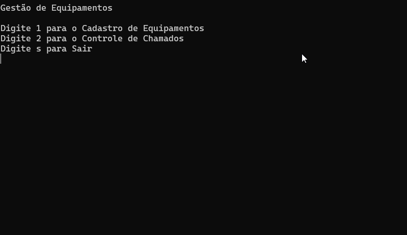

# Gestão de Equipamentos

<p align="center">
	
</p>


## Projeto

Desenvolvido durante o curso Fullstack da [Academia do Programador](https://www.academiadoprogramador.net) 2024

---
## Detalhes

Este software foi desenvolvido para auxiliar na gestão de inventários de equipamentos e no controle de manutenções realizadas nesses equipamentos. O objetivo é proporcionar uma maneira fácil e eficiente para que funcionários possam gerenciar informações relevantes sobre equipamentos e chamados de manutenção.

---
## Entrada

O programa deverá ter um menu interativo para que o usuário possa navegar pelas funcionalidades.

---
## Funcionalidades

### 1. Controle de Equipamentos

- **Registrar Equipamentos:** Permite adicionar novos equipamentos ao sistema com informações como nome, preço de aquisição, número de série, data de fabricação e fabricante.
- **Visualizar Equipamentos:** Exibe uma lista de todos os equipamentos registrados, mostrando detalhes como número, nome, preço, fabricante e data de fabricação.
- **Editar Equipamentos:** Oferece a possibilidade de modificar informações de um equipamento existente.
- **Excluir Equipamentos:** Permite remover um equipamento do sistema, atualizando a lista de equipamentos registrados.
---
## Requisitos

- .NET SDK (recomendado .NET 8.0 ou superior) para compilação e execução do projeto.
---
## Como Usar

#### Clone o Repositório
```
git clone https://github.com/academia-do-programador/gestao-equipamentos-2024.git
```

#### Navegue até a pasta raiz da solução
```
cd gestao-equipamentos-2024
```

#### Restaure as dependências
```
dotnet restore
```

#### Navegue até a pasta do projeto
```
cd GestaoEquipamentos.ConsoleApp
```

#### Execute o projeto
```
dotnet run
```